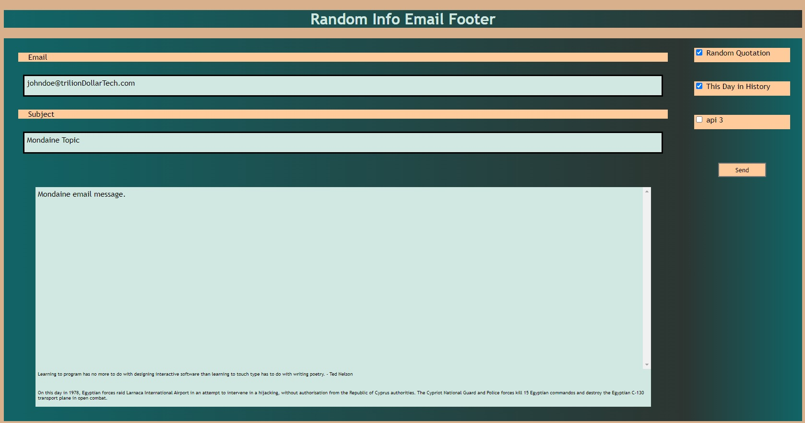
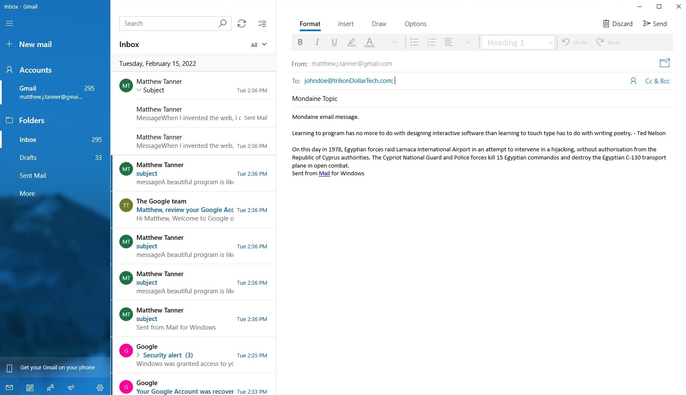

# Proect 1: Email Random Info Footer
### User’s Story: The user wants to make their emails more interesting to garner closer reader attention despite sometimes mondaine content. To do this, we use API’s to place random quotations and historical factoids in the footer. 
### Minimum Acceptance Criteria: 
#### WHEN the user checks the box associated with a type of footer content, 
#### THEN the associated content is inserted in the footer of the email in the message editing area.
#### WHEN the user is finished editing and clicks the ‘send’ button,
#### THEN the user’s default email application opens and is populated with the message content including the selected footer content.
#### WHEN the user clicks ‘send’,
#### THEN the entire email string is saved in local storage with a timestamp key. 
### Top Down Design
#### A. HTML Layout 
##### 1. Header with application title
##### 2. Email header area
###### a. Address field
###### b. Subject line field
###### c. Field labels
##### 3. Email content editing area
###### a. Email message editing area
###### b. Email footer fields (2)
##### 4. Left margin user operation area
###### a. Footer content selection area
###### b. Email send button

#### B. Function
##### 1. API interface funtion
###### a. Assemble URL
###### b. Error check call status
###### c. If response is good, process text. Otherwise bail.
##### 2. mailTo call to open user default email application.

##### 3. Save email string to localStorage. 
